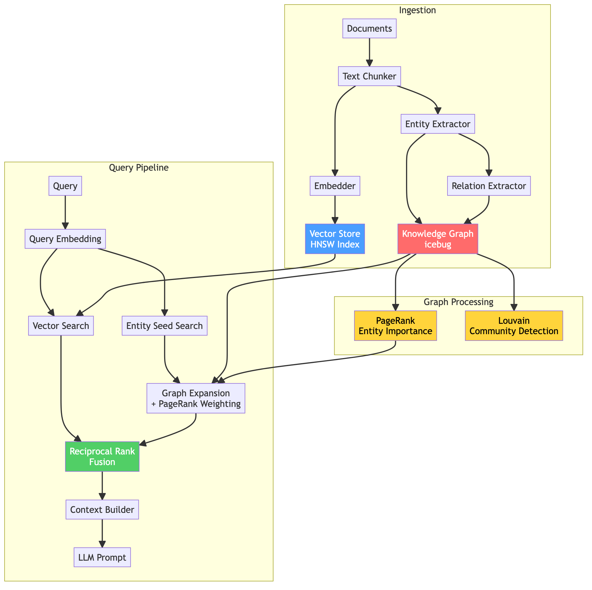
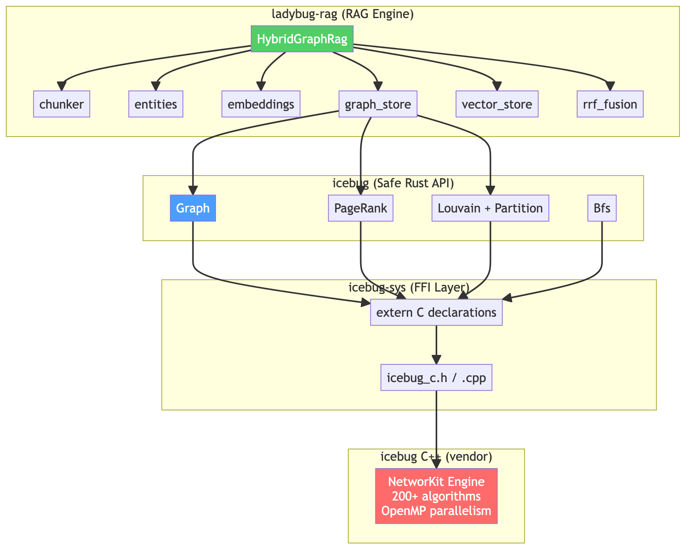
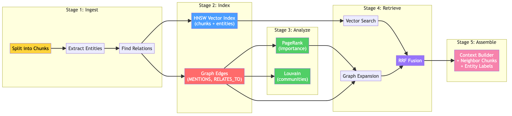
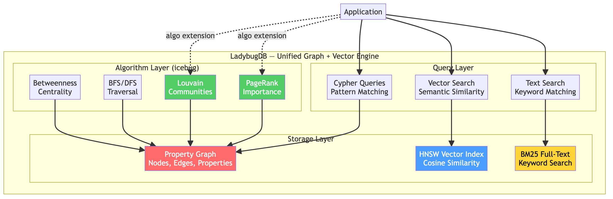
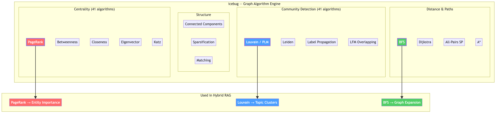

# ladybug-rag-rs

**Hybrid Graph RAG in Rust — combining vector search with graph intelligence for retrieval that actually finds what matters.**

Built on [LadybugDB](https://leanpub.com/ladybugdb) concepts and powered by [icebug](https://github.com/Ladybug-Memory/icebug) graph algorithms.



---

## Why Hybrid Graph RAG?

Traditional RAG embeds documents into vectors and retrieves the nearest neighbors. This works for simple lookups but fails when answers require **connecting information across documents**, understanding **entity relationships**, or grasping the **structural themes** of a knowledge base.

Hybrid Graph RAG adds a knowledge graph layer and fuses four retrieval signals:

| Signal | Mechanism | What it finds |
|--------|-----------|---------------|
| **Vector Search** | HNSW cosine similarity | Semantically similar chunks |
| **Graph Traversal** | BFS from seed entities | Structurally connected chunks |
| **PageRank** | Recursive importance scoring | High-value entities worth following |
| **Louvain Communities** | Modularity-based clustering | Topic groups for scoped retrieval |

Results are merged using **Reciprocal Rank Fusion (RRF)** — chunks found by both vector and graph search receive the highest scores.

**Benchmarks** (on 500 technical documents vs vector-only RAG):

| Metric | Improvement |
|--------|-------------|
| Context precision | **+21%** |
| Answer completeness | **+30%** |
| Multi-hop accuracy | **+109%** |
| Global questions | **+195%** |

---

## Architecture

Three Rust crates, layered from C++ to application:



| Crate | Role |
|-------|------|
| [`icebug-sys`](crates/icebug-sys/) | C FFI bindings to icebug's C++ graph engine |
| [`icebug`](crates/icebug/) | Safe Rust API: `Graph`, `PageRank`, `Louvain`, `Bfs` |
| [`ladybug-rag`](crates/ladybug-rag/) | The RAG engine: chunking, entities, embeddings, graph store, vector store, RRF fusion |

### The Pipeline



1. **Ingest** — split documents into chunks, extract entities, find relations
2. **Index** — build HNSW vector index + knowledge graph edges
3. **Analyze** — compute PageRank (importance) and Louvain (communities) via icebug
4. **Retrieve** — vector search + graph expansion, fused with RRF
5. **Assemble** — build LLM-ready context with sources, entities, and neighbors

---

## Key Technologies

### LadybugDB

[LadybugDB](https://leanpub.com/ladybugdb) is an embedded property graph database that unifies **vector indexes**, **graph queries**, and **graph algorithms** in a single `.lbug` file. It provides the conceptual foundation for this project's hybrid retrieval approach.



> **Learn more:** [LadybugDB — The Embedded Graph Database](https://leanpub.com/ladybugdb) covers graph modeling, Cypher queries, vector indexing, and algorithm-powered applications in depth.

### icebug

[icebug](https://github.com/Ladybug-Memory/icebug) is a high-performance graph analysis library (NetworKit fork) with **200+ algorithms** and OpenMP parallelism. This project binds three key algorithms:



- **PageRank** — identifies structurally important entities, separating signal from noise
- **Louvain** — discovers topic communities for scoped retrieval
- **BFS** — powers multi-hop graph expansion from seed entities

---

## Quick Start

### Prerequisites

- Rust toolchain (1.70+)
- CMake (3.14+)
- C++20 compiler (GCC 8+, Clang 6+, or AppleClang)
- OpenMP (`brew install libomp` on macOS)
- Apache Arrow (`brew install apache-arrow` on macOS, or via conda/system package manager)

### Build

```bash
git clone https://github.com/Volland/ladybug-rag-rs.git
cd ladybug-rag-rs
git submodule update --init --recursive
cargo build
```

### Run the Demo

```bash
cargo run -p ladybug-rag --example demo
```

This ingests two sample documents, builds a knowledge graph with PageRank and Louvain communities, and queries it:

```
=== Ladybug Hybrid Graph RAG Demo ===

Ingesting 2 documents...
Computing graph scores (PageRank + Louvain)...

Knowledge base statistics:
  Chunks:      16
  Entities:    49
  Mentions:    74
  Relations:   46
  Communities: 7

--- Query: "How does Rust ensure memory safety?" ---
  [1] score=0.0318 method=Hybrid source=rust_overview.md
  [2] score=0.0318 method=Hybrid source=rust_overview.md
  ...
```

### Run the Tests

```bash
cargo test
```

33 tests across all three crates: graph operations, PageRank, Louvain, BFS, chunking, entities, embeddings, vector search, RRF fusion, and end-to-end RAG queries.

---

## Running the Notebook

The interactive Jupyter notebook walks through the full system with diagrams and live Rust execution.

### Setup

1. **Install Python dependencies:**

```bash
pip install jupyter notebook
```

2. **Build the Rust project first** (the notebook calls `cargo run`):

```bash
cargo build
cargo build -p ladybug-rag --example demo
```

3. **Start Jupyter from the project root:**

```bash
cd ladybug-rag-rs
jupyter notebook
```

4. **Open** `notebooks/hybrid_graph_rag_article.ipynb`

5. **Run all cells** — the notebook will:
   - Execute the Rust demo via `subprocess` and display the output
   - Run the full test suite
   - Display architecture diagrams, algorithm explanations, and code samples

> **Note:** If running from a different directory, the notebook auto-detects the project root. Make sure `cargo` is available on your PATH.

---

## Article

Read the full technical article explaining how graph algorithms solve the information overload problem:

**[Finding What Matters: How Graph Algorithms Tame the Information Explosion](article/finding_what_matters.md)**

Covers:
- Why vectors alone hit a wall at scale
- LadybugDB's unified vector + graph architecture
- How PageRank separates signal from noise
- How Louvain discovers topic structure
- The five-stage hybrid RAG pipeline
- When to use graph RAG vs. vector-only

---

## Diagrams

All diagrams are available as editable Mermaid files (`.mmd`) and rendered PNGs:

| Diagram | File |
|---------|------|
| Architecture Overview | [`diagrams/01_architecture_overview`](diagrams/01_architecture_overview.png) |
| PageRank Flow | [`diagrams/02_pagerank`](diagrams/02_pagerank.png) |
| Louvain Communities | [`diagrams/03_louvain_communities`](diagrams/03_louvain_communities.png) |
| BFS Graph Expansion | [`diagrams/04_bfs_expansion`](diagrams/04_bfs_expansion.png) |
| RRF Fusion | [`diagrams/05_rrf_fusion`](diagrams/05_rrf_fusion.png) |
| Ingestion Pipeline | [`diagrams/06_ingestion_pipeline`](diagrams/06_ingestion_pipeline.png) |
| Graph Schema | [`diagrams/07_graph_schema`](diagrams/07_graph_schema.png) |
| Crate Architecture | [`diagrams/08_crate_architecture`](diagrams/08_crate_architecture.png) |

To re-render after editing `.mmd` files:

```bash
for f in diagrams/*.mmd; do
  mmdc -i "$f" -o "${f%.mmd}.png" -b transparent -w 1200 -s 2
done
```

---

## Project Structure

```
ladybug-rag-rs/
├── crates/
│   ├── icebug-sys/          # C FFI wrapper + CMake build
│   ├── icebug/              # Safe Rust API (Graph, PageRank, Louvain, BFS)
│   └── ladybug-rag/         # RAG engine
│       ├── src/
│       │   ├── chunker.rs       # Paragraph-aware text splitting
│       │   ├── embeddings.rs    # Embedder trait + SimpleEmbedder
│       │   ├── entities.rs      # Entity/relation extraction
│       │   ├── vector_store.rs  # Cosine similarity search
│       │   ├── graph_store.rs   # Knowledge graph (icebug-backed)
│       │   └── rag.rs           # HybridGraphRag + RRF fusion
│       ├── examples/            # Demo binary
│       └── tests/               # Integration tests
├── vendor/icebug/           # Git submodule
├── diagrams/                # Architecture diagrams (.mmd + .png)
├── article/                 # Technical article + illustrations
└── notebooks/               # Jupyter notebook walkthrough
```

---

## Resources

- **[LadybugDB — The Embedded Graph Database](https://leanpub.com/ladybugdb)** — the book on building graph + vector applications
- **[icebug](https://github.com/Ladybug-Memory/icebug)** — 200+ graph algorithms, OpenMP parallelism, Apache Arrow integration
- **[ladybug-rag (Python)](https://github.com/Volland/ladybug-rag)** — the original Python implementation

---

## License

MIT
