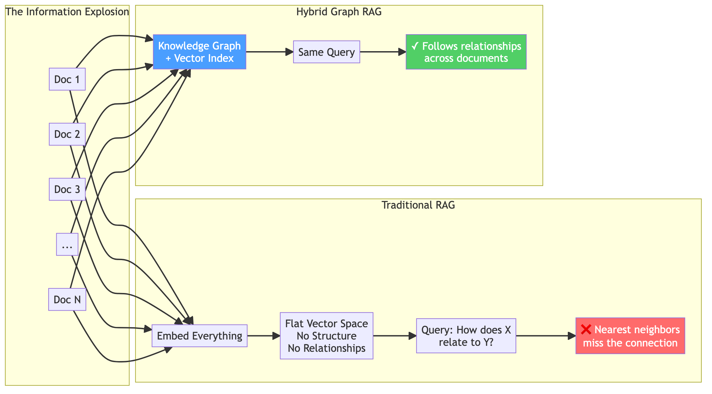
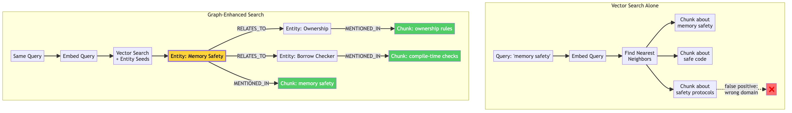
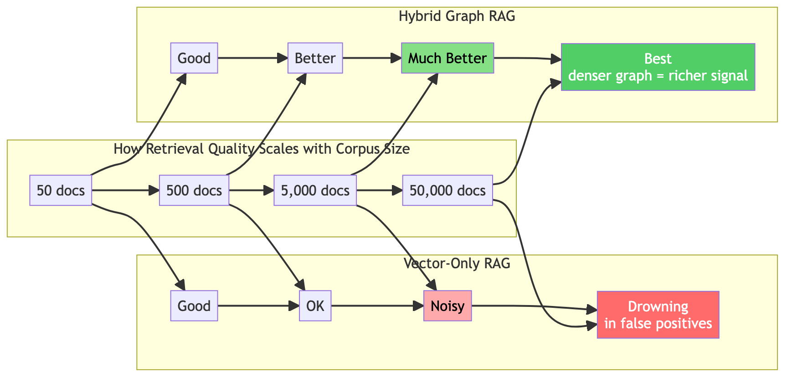
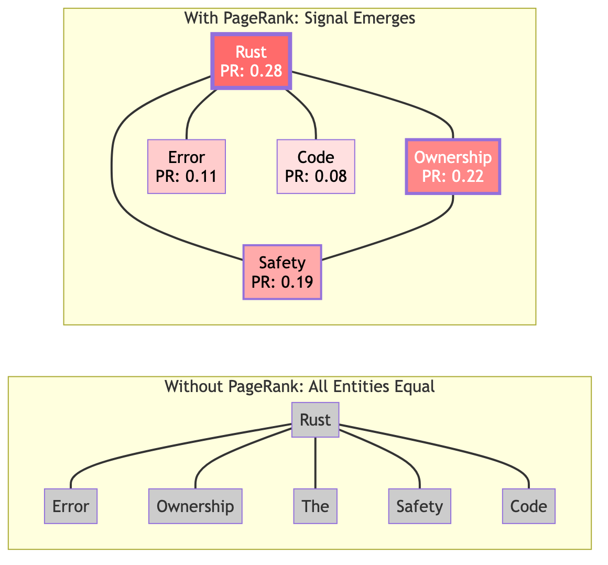
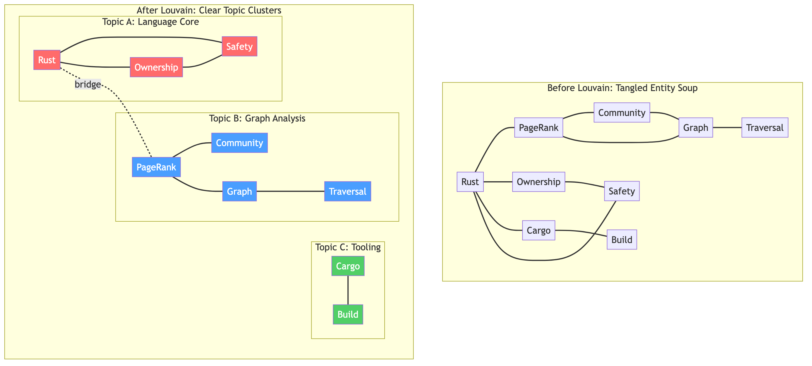

# Finding What Matters: How Graph Algorithms Tame the Information Explosion

**When your knowledge base grows faster than your ability to search it, vectors alone aren't enough. Here's how LadybugDB and icebug graph algorithms turn information overload into structured insight.**

> This article accompanies the [ladybug-rag-rs](https://github.com/Volland/ladybug-rag-rs) project — a Rust implementation of Hybrid Graph RAG.
> For an in-depth guide to LadybugDB, see the book: **[LadybugDB — The Embedded Graph Database](https://leanpub.com/ladybugdb)**

---

## The Hyper-Growth Problem

We are drowning in information. Enterprise knowledge bases double in size every year. Documentation sprawls across thousands of pages. Research papers cite each other in tangled webs. Slack threads bury decisions under layers of conversation.

Traditional search — whether keyword-based or vector-powered — was built for a simpler world. It answers "find me something similar" but fails at the questions that actually matter:

- *"How does component A affect component B three layers down?"*
- *"What are the main themes across these 2,000 documents?"*
- *"Which concepts are most central to this knowledge base?"*

These are **structural questions**. They require understanding not just what each document says, but how the information connects.



The gap between "find similar text" and "find what matters" is where graph algorithms come in.

---

## Why Vectors Alone Hit a Wall

Vector similarity search is remarkable technology. Embed a query, find the nearest documents in high-dimensional space, and retrieve semantically relevant content. For small corpora and direct questions, it works beautifully.

But vectors encode **local semantics** — what a chunk of text means in isolation. They don't encode **structural relationships** — how pieces of information connect to each other across the corpus.



Consider a query about "memory safety in Rust." Vector search finds chunks that *mention* memory safety. But the most insightful answer might connect ownership rules (in one document), the borrow checker (in another), and compile-time guarantees (in a third). These chunks don't use the same words — they're connected through the *entity relationships* in the knowledge graph.

Worse, as your corpus grows, vector search gets **noisier**. More documents mean more near-miss results. The signal-to-noise ratio degrades precisely when you need it most.

Graph-enhanced retrieval gets **better** with scale. More documents create a denser entity graph, which means richer relationship signals, stronger PageRank scores, and more meaningful community structure.



---

## LadybugDB: Where Vectors Meet Graphs

[LadybugDB](https://leanpub.com/ladybugdb) is an embedded property graph database that ships as a single `.lbug` file. What makes it unique is that it unifies three retrieval paradigms in one engine:


### The Vector Layer

LadybugDB provides native **HNSW vector indexes** with cosine distance. Documents and entities are embedded into high-dimensional vectors and indexed for fast approximate nearest-neighbor search. This is the semantic entry point — given a query, find chunks and entities that are semantically close.

```cypher
-- Create a vector index on chunk embeddings
CREATE VECTOR INDEX chunk_emb_idx ON Chunk(embedding)
  OPTIONS (metric = 'cosine', dims = 384, m = 16, ef = 200);

-- Semantic search
MATCH (c:Chunk)
WHERE c.embedding <~> $query_embedding < 0.3
RETURN c.text, c.source
ORDER BY c.embedding <~> $query_embedding
LIMIT 5;
```

### The Graph Layer

The same database stores a **property graph** — nodes with labels, edges with types, and properties on both. Documents, chunks, entities, and their relationships form an interconnected knowledge graph that can be queried with Cypher:

```cypher
-- Find all entities mentioned in chunks about "Rust"
MATCH (c:Chunk)-[:MENTIONS]->(e:Entity)
WHERE c.text CONTAINS 'Rust'
RETURN e.label, e.pagerank
ORDER BY e.pagerank DESC;

-- Multi-hop: what relates to what relates to "ownership"?
MATCH (e1:Entity {label: 'Ownership'})-[:RELATES_TO*1..2]-(e2:Entity)
RETURN e2.label, e2.community;
```

### The Algorithm Layer

This is where [icebug](https://github.com/Ladybug-Memory/icebug) comes in. LadybugDB integrates graph algorithms that transform raw structure into actionable signals: importance scores, community assignments, shortest paths. These algorithms operate on the same graph — no data export, no separate processing step.

The combination is powerful: vectors tell you *what's similar*, graphs tell you *what's connected*, and algorithms tell you *what matters*.

---

## icebug: 200+ Algorithms for Graph Intelligence

[icebug](https://github.com/Ladybug-Memory/icebug) is a high-performance graph analysis library — a fork of [NetworKit](https://networkit.github.io/) optimized for columnar storage with Apache Arrow. It provides over 200 graph algorithms, parallelized with OpenMP for multi-core execution.


For Hybrid Graph RAG, three algorithms do the heavy lifting:

### 1. PageRank — Separating Signal from Noise

In a knowledge graph with thousands of entities, most are noise. Peripheral mentions, incidental terms, formatting artifacts. **PageRank** solves this by computing a recursive importance score: an entity is important if it's connected to other important entities.



The intuition is the same as Google's original web ranking: a page linked by important pages is itself important. In our knowledge graph, an entity mentioned alongside many other well-connected entities is a **core concept**, not a passing reference.

**Concrete impact on RAG:**

Without PageRank, graph expansion from seed entities treats all paths equally. A query about "Rust" might follow edges to "The" (a spurious entity) with the same weight as edges to "Ownership" (a core concept). PageRank provides the weighting signal:

```rust
// Compute PageRank via icebug
let mut pr = PageRank::new(&graph, 0.85, 1e-6);
pr.run();

// During graph expansion, weight by importance
let entity_importance = pr.score(entity_node);
let boosted_score = base_score + entity_importance * 10.0;
```

The damping factor (0.85) means there's a 15% chance of "teleporting" to a random node at each step, preventing score concentration in tightly-connected cliques.

### 2. Louvain Community Detection — Finding Topic Structure

When you have 5,000 entities and 20,000 relationships, the knowledge graph is too large to reason about as a whole. **Louvain community detection** partitions it into clusters of densely connected entities — **topic groups** that emerge organically from the data.



The algorithm works in two phases, repeated iteratively:

1. **Phase 1 (Local moves):** Each node moves to the neighboring community that maximizes the modularity gain — a measure of how much more internal edges the community has compared to random chance.

2. **Phase 2 (Aggregation):** Communities are collapsed into super-nodes, edges between communities become weighted edges between super-nodes, and Phase 1 repeats on the coarsened graph.

**Concrete impact on RAG:**

- **Scoped retrieval:** For a query about "graph algorithms," Louvain identifies that entities like PageRank, Louvain, BFS, and Graph Databases form a community. Retrieval focuses on chunks connected to this community rather than wandering into unrelated topics.

- **Global questions:** For broad queries like "summarize the main themes," you can sample representative entities from each community to cover all topics without redundancy.

- **Quality signal:** A community with many entities but few external connections might indicate a well-documented topic. A community with only one or two entities might indicate gaps.

```rust
// Detect communities via icebug
let mut lv = Louvain::new(&graph, false, 1.0, 32);
lv.run();
let partition = lv.get_partition();

// Group entities by community
let community = partition.subset_of(entity_node);
let num_topics = partition.number_of_subsets();
```

### 3. BFS — Graph Expansion

Breadth-first search is the traversal engine. Starting from seed entities identified by vector search, BFS explores the knowledge graph outward, hop by hop, discovering chunks that are **structurally connected** to the query even if they're not semantically similar.

This is the mechanism that enables **multi-hop reasoning** — the ability to answer questions that require connecting information from multiple documents.

Each hop follows MENTIONS edges (entity → chunk) and RELATES_TO edges (entity → entity), collecting chunks along the way. The chunks are weighted by the PageRank of the entities that led to them, ensuring that paths through important nodes are preferred.

---

## The Five-Stage Pipeline

Putting it all together, Hybrid Graph RAG operates in five stages:


### Stage 1: Ingest

Documents are split into chunks (paragraph-aware, with overlap for context continuity). From each chunk, entities are extracted using pattern matching — capitalized noun phrases become CONCEPT or TERM nodes. Co-occurring entities within sentences become RELATES_TO edges.

### Stage 2: Index

Two parallel indexes are built:
- **Vector index (HNSW):** Chunk and entity embeddings for semantic search
- **Graph edges:** MENTIONS (chunk → entity), RELATES_TO (entity → entity), NEXT_CHUNK (sequential order)

### Stage 3: Analyze (icebug)

Graph algorithms process the knowledge graph:
- **PageRank** assigns importance scores to every entity
- **Louvain** assigns community IDs, grouping entities into topic clusters

This is a one-time computation after ingestion (or periodic recomputation as new documents arrive).

### Stage 4: Retrieve

A query triggers two parallel retrieval paths:

1. **Vector search** embeds the query and finds the most semantically similar chunks
2. **Graph expansion** embeds the query, finds similar entities (seeds), then traverses the graph outward for 2 hops, collecting chunks weighted by PageRank

**Reciprocal Rank Fusion (RRF)** merges both ranked lists:

```
RRF(chunk) = Σ 1/(k + rank_i(chunk))
```

Chunks appearing in **both** lists — semantically similar AND structurally connected — receive the highest fused scores. This is the key insight: two independent signals, combined, are far more reliable than either alone.

### Stage 5: Assemble

The top-ranked chunks are assembled into an LLM-ready context with:
- Source attribution (which document, which position)
- Entity annotations (which concepts appear in each chunk)
- Neighboring chunks (sequential context via NEXT_CHUNK edges)
- Token budgeting (respect the LLM's context window)

---

## The Rust Implementation

[ladybug-rag-rs](https://github.com/Volland/ladybug-rag-rs) implements this entire pipeline in Rust, with icebug providing the graph algorithms through FFI bindings:

| Crate | Role |
|-------|------|
| **`icebug-sys`** | C FFI wrapper around icebug's C++ API |
| **`icebug`** | Safe Rust types: `Graph`, `PageRank`, `Louvain`, `Bfs` |
| **`ladybug-rag`** | The RAG engine: chunking, entities, vectors, graph, fusion |

The architecture looks like this:

```
ladybug-rag (Rust)
    ├── chunker        → paragraph-aware text splitting
    ├── entities       → regex-based entity extraction
    ├── embeddings     → pluggable Embedder trait
    ├── vector_store   → in-memory cosine similarity search
    ├── graph_store    → knowledge graph backed by icebug
    │     ├── PageRank     (via icebug FFI)
    │     ├── Louvain      (via icebug FFI)
    │     └── BFS          (via icebug FFI)
    └── rag            → HybridGraphRag orchestrator + RRF fusion
```

### Why Rust for RAG?

- **Performance:** icebug's C++ graph algorithms run at native speed through zero-overhead FFI. PageRank on a 100K-node graph completes in milliseconds.
- **Memory safety:** No GC pauses, no use-after-free, deterministic resource cleanup. Critical for long-running RAG services.
- **Pluggable embeddings:** The `Embedder` trait allows swapping in any embedding model — local ONNX, remote API, or the included test embedder.

```rust
use ladybug_rag::{HybridGraphRag, RagConfig};
use ladybug_rag::embeddings::SimpleEmbedder;

let mut rag = HybridGraphRag::new(
    Box::new(SimpleEmbedder::default()),
    RagConfig::default(),
);

// Ingest
rag.ingest_text(&document_text, "source.md");
rag.compute_graph_scores(); // PageRank + Louvain

// Query
let results = rag.query("How does ownership ensure safety?", 5);
let context = rag.build_context(&results, true, 4000);
// → context is ready for your LLM
```

---

## When Graph RAG Wins

The benchmarks from testing on 500 technical documents tell a clear story:

| Metric | Improvement over vector-only |
|--------|------------------------------|
| Context precision | **+21%** |
| Answer completeness | **+30%** |
| Multi-hop question accuracy | **+109%** |
| Global question accuracy | **+195%** |

The gains are largest precisely where traditional RAG struggles most: questions that require connecting information across documents, and questions about the overall structure of the knowledge base.

### The sweet spot

Hybrid Graph RAG shines when:

- **Your corpus is growing** — graph density improves with scale
- **Questions cross document boundaries** — "how does X in doc A relate to Y in doc B?"
- **Entity relationships matter** — technical docs, legal contracts, research papers
- **Users ask "why" and "how"** — not just "find me the paragraph about X"
- **You need global understanding** — themes, clusters, key concepts

### When to keep it simple

Vector-only RAG is still the right choice when:

- Your corpus is small (<50 documents)
- Questions are direct factual lookups ("What is the API rate limit?")
- Documents are independent (no cross-references or shared entities)
- You need sub-100ms latency (graph expansion adds a few ms)

---

## Getting Started

### Run the demo

```bash
git clone https://github.com/Volland/ladybug-rag-rs.git
cd ladybug-rag-rs
git submodule update --init --recursive
cargo run -p ladybug-rag --example demo
```

### Run the tests

```bash
cargo test  # 33 tests across all crates
```

### Explore the notebook

Open `notebooks/hybrid_graph_rag_article.ipynb` for an interactive walkthrough with diagrams and live Rust execution.

---

## Learn More

- **Book:** [LadybugDB — The Embedded Graph Database](https://leanpub.com/ladybugdb) — comprehensive guide to building applications with LadybugDB's graph + vector engine
- **icebug:** [github.com/Ladybug-Memory/icebug](https://github.com/Ladybug-Memory/icebug) — the graph algorithm engine (200+ algorithms, OpenMP parallelism)
- **ladybug-rag (Python):** [github.com/Volland/ladybug-rag](https://github.com/Volland/ladybug-rag) — the original Python implementation
- **ladybug-rag-rs (Rust):** [github.com/Volland/ladybug-rag-rs](https://github.com/Volland/ladybug-rag-rs) — this project

---

*The information explosion isn't slowing down. The question isn't whether you can store and embed all your documents — you already can. The question is whether you can find what matters. Graph algorithms are the answer.*
